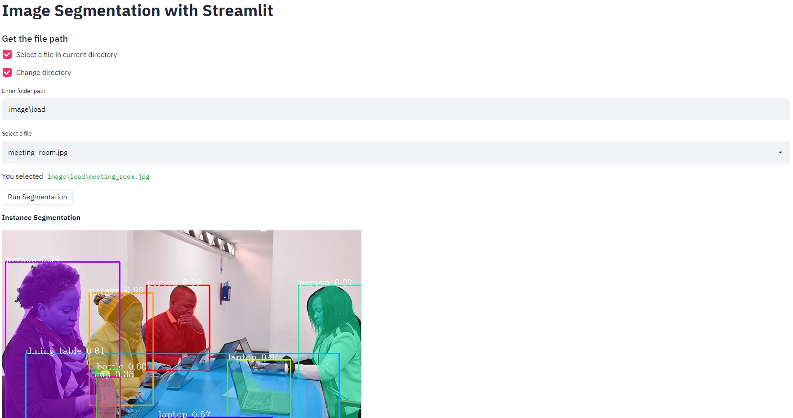
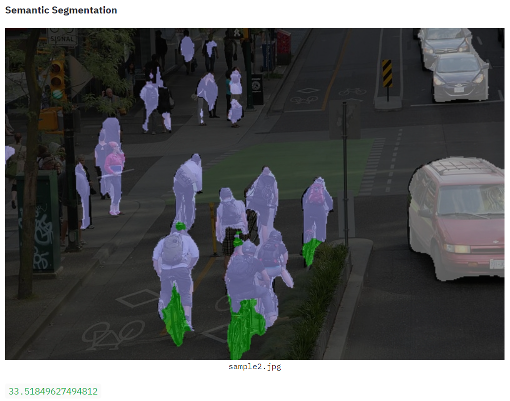
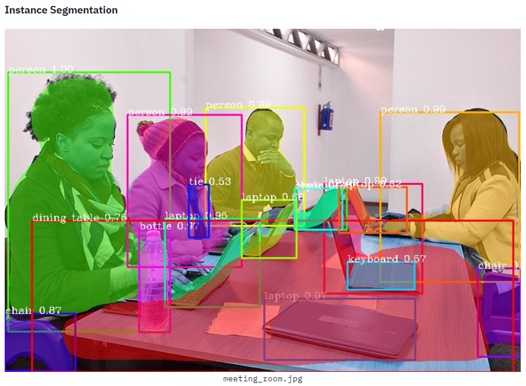

# Image Segmentation with PixelLib and Streamlit

## Models
Download the xception model from [here](https://github.com/ayoolaolafenwa/PixelLib/releases/download/1.1/deeplabv3_xception_tf_dim_ordering_tf_kernels.h5)
Download the mask rcnn model from [here](https://github.com/ayoolaolafenwa/PixelLib/releases/download/1.2/mask_rcnn_coco.h5)

## Image Segmentation

### Semantic Segmentation

### Instance Segmentation

